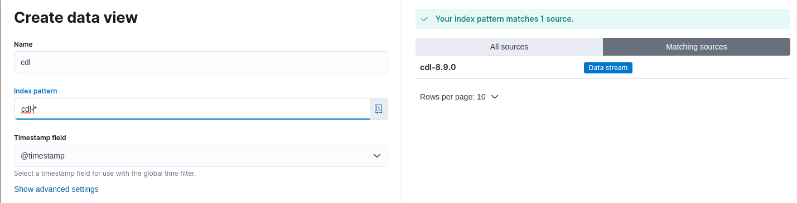

# Prisma Access - Cortex Data Lake - Syslog to Elasticsearch Log Forward

Palo Alto Networks Cortex Data Lake allows for forwarding Prisma Access logs to a syslog server over TCP & TLS.

This repository provides an easy way to ingest logs to an Elasticsearch instance using Docker-Compose and
- rsyslogd (8.2306.0)
- filebeat (8.9.0)
- elasticsearch (8.9.0)

It also provides mappings for a subset of the Prisma Access Log Types, including
- Firewall/Traffic
- Firewall/Threat
- Firewall/URL
- Firewall/File
- Firewall/HIP Match
- Firewall/GlobalProtect
- Firewall/UserID
- Firewall/Decryption
- Commmon/System

## Kibana Dashboards

The Docker environment ships a Kibana (8.9.0) container as well. After log ingestion has been set up you can 
easily query the database using the Kibana GUI.


Providing pre-created dashboards for Kibana is beyond the scope of this repository, but obviously you can use Kibana
to build custom dashboards as well.


Some standard dashboards may be added to this repo, in case I'll come up with something useful.

## Setup

Follow the next steps to start ingesting Logs into the pipeline. I am testing on
- Docker version 20.10.24+
- Docker Compose version v2.20.2

on a Debian Bookworm environment.

## Configure rsyslog server certificate

Cortex Data Lake (CDL) wants to talk to a syslog server over TCP/TLS. So we need a certificate for this. I am going to use a
self-signed certificate here. Use your own PKI or other ways to obtain key material. We will need a certificate & corresponding
private key. I will configure CDL to talk to my syslog server using an IP address. Make sure your certificate
covers the Host/IP of your receiving system.

```
$ openssl req -x509 -newkey rsa:4096 -keyout key.pem -out cert.pem -sha256 -days 3650 \
    -nodes -subj "/C=XX/ST=StateName/L=CityName/O=CompanyName/OU=CompanySectionName/CN=CommonNameOrHostname" \
    -addext "subjectAltName = IP:1.2.3.4"
```

Copy certificate and key file as PEMs to the rsyslog 
```
$ cp {cert.pem,key.pem} rsyslog/tls
```

## Start Docker Containers

Ignition!
```
$ docker compose up
```

This will take a couple of minutes pulling images, starting containers. Once finished, it exposes the following ports
to the host system:
- tcp/9200 (Elasticsearch API)
- tcp/5160 (Kibana UI)
- tcp/5164 (rsyslog Ingest Port)

## Configure Cortex Data lake (CDL)
We are good to start configuring Log Export. Follow the CDL guide on how to
[Forward Logs from Cortex Data Lake to a Syslog Server](https://docs.paloaltonetworks.com/cortex/cortex-data-lake/cortex-data-lake-getting-started/get-started-with-log-forwarding-app/forward-logs-from-logging-service-to-syslog-server)
or simply:
- Add a new Syslog profile
  - Pick a name/description for your server
  - Specify destination Host/IP. 
  - Speficy destination port. This repository uses the syslog-tls default port **6514**
  - Upload your self-signed certificate
  - Click on Test Connection, Next
- Configure Syslog Forwarding Profile
  - Format: **CSV**
  - Delimiter: **Comma**
  - Filters: The Log Types mentioned above are supported

It is important that you use the default set of attributes for each of the Log Types. You should not change the order of 
Log attributes either as this will break the field mappings defined in `filebeat/filebeat.yml`. The mappings are up-to-date
as of August 2023.

Save the configuration and CDL will start exporting Logs to your syslog instance.

## Tinkering with Kibana

If you want to play around with Kibana, go to `http://127.0.0.1:5601` and create a Data View.
Filebeat will ingest logs using a `cdl-*` Index Pattern.



Save the Data View and you can start exploring logs.

# Closing Remarks

This repository is provided as-is and neither guarantees that it is bug-free nor support can be given. 
Do not use this setup in production. Elasticsearch & Kibana authentication mechanisms are disabled to make this guide as
simple as possible.